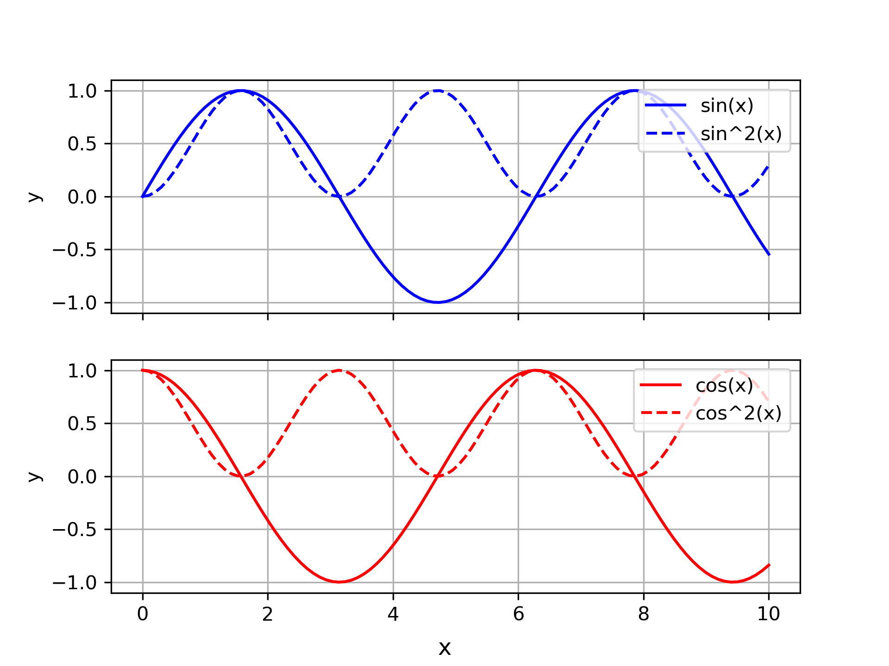
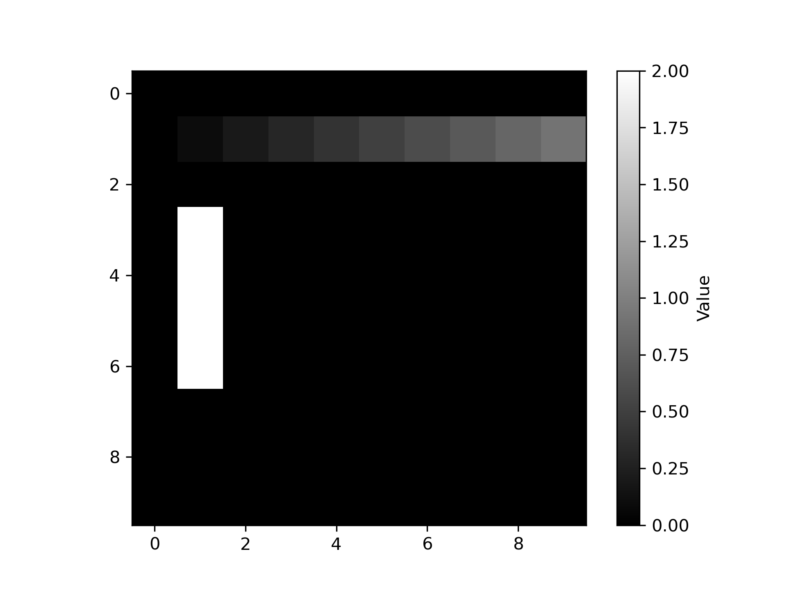
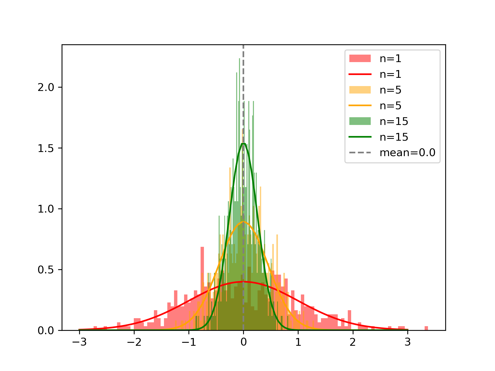
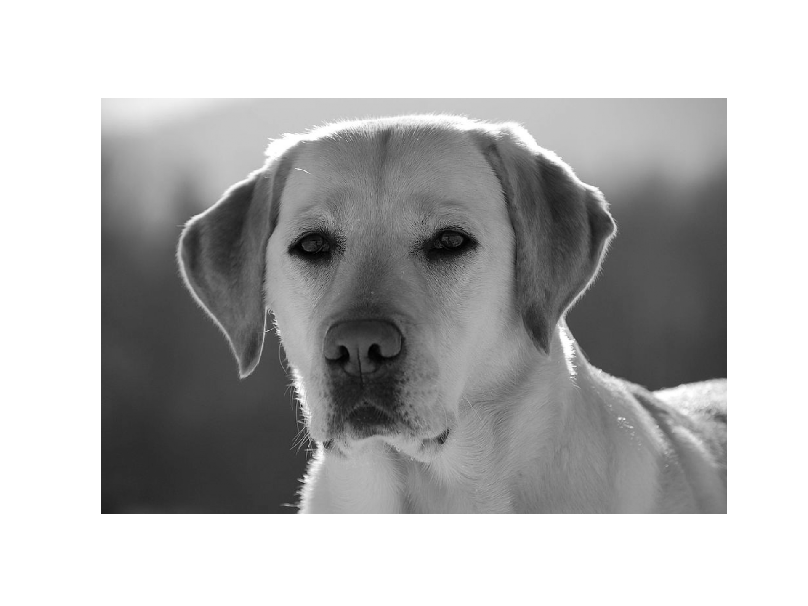
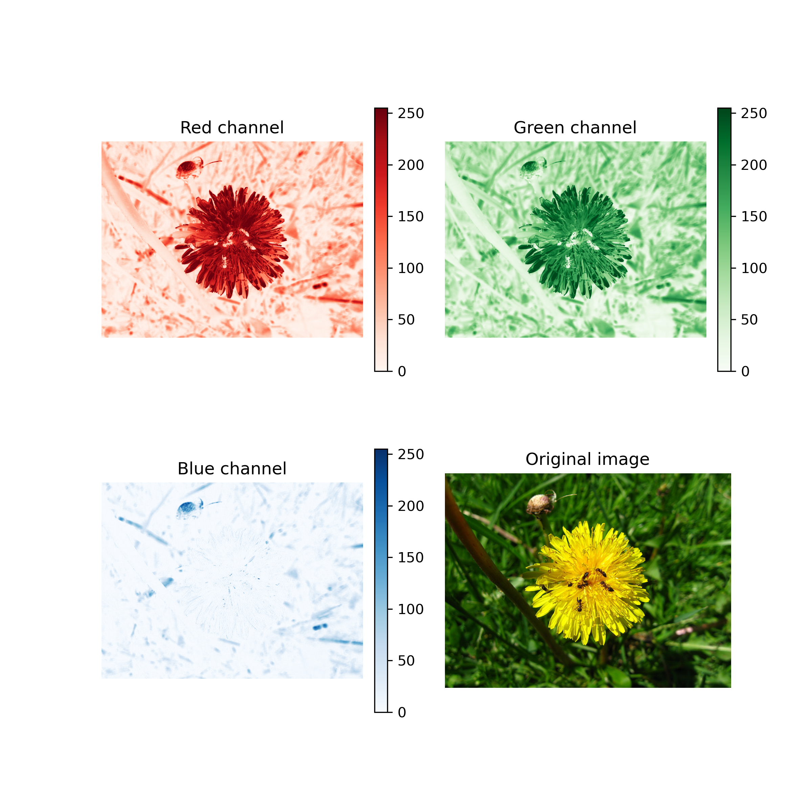
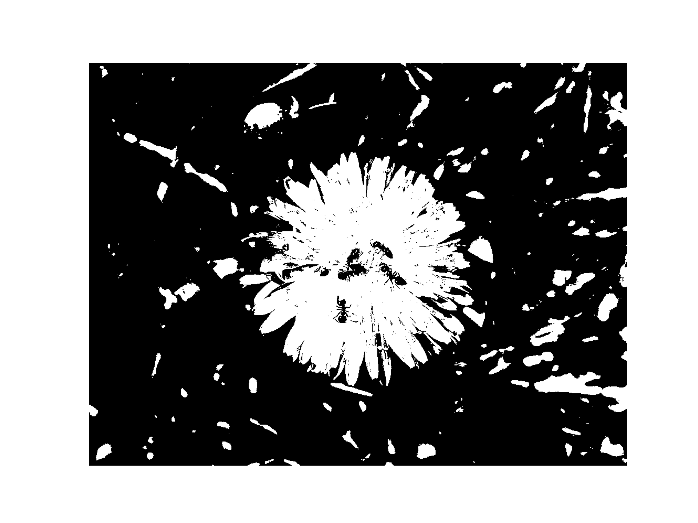
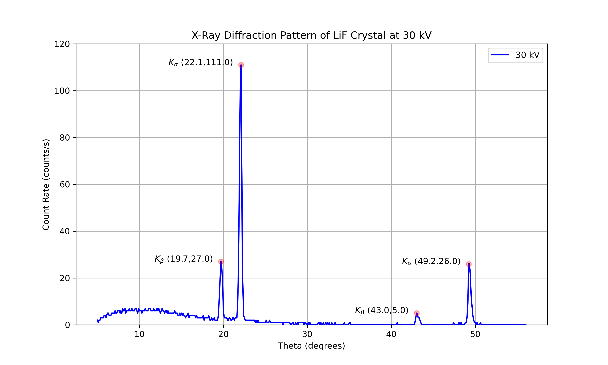

# python-basics
Repository to revise my Python basics, including the use of numpy, matplotlib, pandas, and other Python libraries.  
Includes small demo scripts as well as a full analysis of X-Ray diffraction (XRD) data.

---

## Contents

### **Sine and Cosine Plots**  
- **File:** `py scripts/01_sine_cosine.py`  
- **Description:** Plot sine, cosine, and their squares on subplots.  
- **Libraries used:** numpy, matplotlib  

**Example Output:**  


---

### **Show Numpy Array as an Image**  
- **File:** `py scripts/02_numpy-imshow.py`  
- **Description:** Create a numpy array with zeroes, change values, and plot the values as an image.  
- **Libraries used:** numpy, matplotlib  

**Example Output:**  
  

---

### **Random Samples and Histograms (Central Limit Theorem)**  
- **File:** `py scripts/03_random-histogram.py`  
- **Description:** Generate random samples from a normal distribution, compute sample means, and plot histograms. Demonstrates how the sample mean distribution approaches normality as sample size increases.  
- **Libraries used:** numpy, matplotlib  

**Example Output:**  
  

---

### **Image Processing with scikit-image**  
- **File:** `py scripts/04_skimage.py`  
- **Description:** Demonstrates basic image processing techniques:  
  - Convert a color image to grayscale  
  - Display RGB channels separately alongside the original image  
  - Apply Otsu’s thresholding method to segment a grayscale image  
- **Libraries used:** scikit-image, matplotlib  

**Example Output:**  
Grayscale Labrador:  
  

RGB Channels and Original Ants Image:  
  

Otsu Thresholded Binary Ants Image:  
  

---

### **X-Ray Diffraction (XRD) Analysis of LiF Crystal**  
- **File:** `py scripts/05_xrd-analysis.py`  
- **Description:** Reads experimental XRD data from Excel, plots the diffraction spectrum, identifies peaks, and calculates the lattice constant using Bragg’s law.  
- **Libraries used:** pandas, numpy, matplotlib, openpyxl  

**Example Output (Plot):**  
  

**Example Output (Console):**  
```text
Peaks: [[22.1, 111.0], [19.7, 27.0], [49.2,26.0], [43.0, 5.0]]
d (nm): [0.204 0.206 0.203 0.204]
LiF is face centered cubic lattice.
Lattice constant (nm): 0.409
